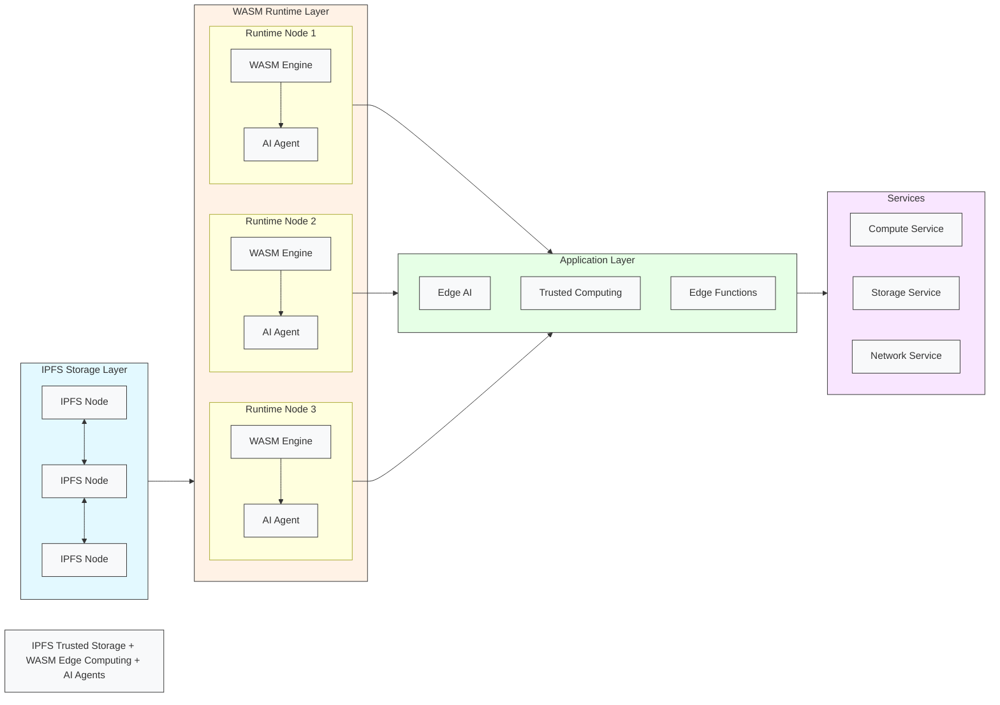

# dANP-Engine


**dANP-Engine** is an innovative framework that seamlessly integrates **WebAssembly (WASM) computing**, **IPFS storage**, and **AI Agent capabilities** to deliver a robust, serverless solution for decentralized applications (dApps). Designed to empower developers with cutting-edge technologies, this project revolutionizes decentralized computing by combining the efficiency of WASM, the reliability of IPFS, and the intelligence of AI Agents.


---

## Key Features and Components

- **WebAssembly Computing**: Harness the power of WebAssembly for efficient, scalable, and portable computation within decentralized applications.
- **IPFS Integration**: Utilize IPFS for secure, decentralized storage and retrieval of data, ensuring data integrity and availability.
- **AI Agent Capabilities**: Empower your applications with intelligent decision-making, automation, and multi-agent control powered by AI.
- **Serverless Architecture**: Embrace a serverless paradigm for flexible, cost-effective deployment of dApps, eliminating the complexities of traditional server management.
- **Technical Support**: Benefit from seamless integration with **Filecoin-Lassie** for IPFS file retrieval, **Filecoin-IPLD-Go-Car** for IPFS Car file extraction, **Extism** for WASM plugin management, **wazero** for WASM virtual machine, and **Fiber** for high-performance HTTP server capabilities.

---
## System Architecture


The architecture consists of four main layers:

* IPFS Storage Layer: Decentralized storage network that provides content-addressable storage for WASM modules and application data
* WASM Runtime Layer: Distributed execution environment where WASM modules run with AI Agent capabilities
* Application Layer: Core functionalities exposed to developers including Edge AI, Trusted Computing and Edge Functions
* Services Layer: Final output services that applications can consume (Compute, Storage, Network)

## How It's Made

Here's a breakdown of how **dANP-Engine** was built, including the technologies used, their integration, and notable aspects:

### WebAssembly (WASM) Computing
- **Technology**: Leveraged WebAssembly for its efficient and portable bytecode format, enabling high-performance computing within the serverless environment.
- **Integration**: Integrated WebAssembly runtime libraries and tools to compile and execute WASM modules seamlessly within the serverless framework.

### IPFS Integration
- **Technology**: Utilized IPFS (InterPlanetary File System) for decentralized storage and retrieval of data.
- **Integration**: Integrated IPFS libraries and APIs to interact with the IPFS network, ensuring secure and decentralized data storage and retrieval.

### AI Agent Capabilities
- **Technology**: Integrated advanced AI frameworks to enable intelligent decision-making, automation, and multi-agent control.
- **Integration**: Combined AI Agent capabilities with WASM and IPFS to create a powerful, intelligent, and decentralized computing ecosystem.

### Partner Technologies and Benefits
- **Filecoin-Lassie**: Leveraged for IPFS file retrieval, enhancing data access capabilities within the serverless environment.
- **Filecoin-IPLD-Go-Car**: Used for IPFS Car file extraction, enabling efficient handling of IPFS Car files within the project.
- **Extism**: Integrated for WASM plugin management, facilitating extensibility and customization of the serverless environment through WASM plugins.
- **wazero**: Utilized for WASM virtual machine capabilities, ensuring efficient execution of WebAssembly code within the serverless framework.
- **Fiber**: Integrated for high-performance HTTP server functionalities, enhancing network communication and HTTP request handling within the serverless environment.

### Notable Aspects
- **Dynamic IPFS Integration**: Dynamically integrated with IPFS using Filecoin-Lassie and IPFS CID references in the configuration, allowing for seamless interaction with IPFS resources.
- **AI-Driven Automation**: Enabled intelligent automation and decision-making through AI Agent integration, making decentralized computing smarter and more efficient.

---

## Quick Start

### 1. Clone the Repository
```bash
git clone https://github.com/IceFireLabs/dANP-Engine.git
```

### 2. Build the Project
```bash
cd dANP-Engine
make
```

### 3. Adjust Configuration File
```yaml
app-type: "dANP-Engine-WORKER"

# The network model of HTTP handle: NetPoll (gin) or RAWEPOLL (fiber)
net-model: "NETPOLL"

# Process inflow traffic network configuration
NetWork:
  bind-network: "TCP" # Network transport layer type: TCP | UDP
  protocol-type: "HTTP" # Application layer network protocol: HTTP | RESP | QUIC
  bind-address: "127.0.0.1:28080" # Network listening address

# Runtime debug option
debug:
  enable: false
  pprof-bind-addr: "127.0.0.1:19090"

wasm-modules-files:
  enable: false
  path:
    - "hello.wasm"

wasm-modules-ipfs:
  enable: true
  lassie-net:
    scheme: "http"
    host: "38.45.67.159" # Filecoin Lassie daemon bind IP (temporary address; visit https://github.com/filecoin-project/lassie for setup)
    port: 62156 # Filecoin Lassie daemon bind Port
  cids:
    - "QmeDsaLTc8dAfPrQ5duC4j5KqPdGbcinEo5htDqSgU8u8Z" # WASM IPFS CID
```

### 4. Load Configuration and Run
```bash
dANP-Engine -c wis_worker.yaml
```

### 5. Test the IPFS Version of WASM Serverless
```bash
curl -d "dANP-Engine" "http://localhost:28080"

👋 Hello dANP-Engine%
```

---

## Performance Testing

```bash
hey -n 1000000 -c 50 -m POST \
-d 'dANP-Engine' \
"http://127.0.0.1:28080"

Summary:
  Total:        25.5373 secs
  Slowest:      0.0360 secs
  Fastest:      0.0001 secs
  Average:      0.0013 secs
  Requests/sec: 39158.4411
  
  Total data:   31000000 bytes
  Size/request: 31 bytes

Response time histogram:
  0.000 [1]     |
  0.004 [995857]        |■■■■■■■■■■■■■■■■■■■■■■■■■■■■■■■■■■■■■■■■
  0.007 [3829]  |
  0.011 [205]   |
  0.014 [22]    |
  0.018 [14]    |
  0.022 [18]    |
  0.025 [4]     |
  0.029 [0]     |
  0.032 [0]     |
  0.036 [50]    |

Latency distribution:
  10% in 0.0002 secs
  25% in 0.0004 secs
  50% in 0.0014 secs
  75% in 0.0017 secs
  90% in 0.0021 secs
  95% in 0.0024 secs
  99% in 0.0031 secs

Details (average, fastest, slowest):
  DNS+dialup:   0.0000 secs, 0.0001 secs, 0.0360 secs
  DNS-lookup:   0.0000 secs, 0.0000 secs, 0.0000 secs
  req write:    0.0000 secs, 0.0000 secs, 0.0135 secs
  resp wait:    0.0012 secs, 0.0000 secs, 0.0349 secs
  resp read:    0.0000 secs, 0.0000 secs, 0.0049 secs

Status code distribution:
  [200] 1000000 responses
```

---

## Contributing

We welcome contributions from the community! To contribute to **dANP-Engine**:

1. Fork the repository.
2. Create a new branch (`git checkout -b feature/your-feature`).
3. Make your changes and commit them (`git commit -am 'Add new feature'`).
4. Push your changes to the branch (`git push origin feature/your-feature`).
5. Create a new Pull Request.

---

## License

This library is dual-licensed under **Apache 2.0** and **MIT** terms.

---

## ❤️ Thanks for Technical Support ❤️

1. [**Filecoin-Lassie**](https://github.com/filecoin-project/lassie/): Support IPFS file retrieval.
2. [**Filecoin-IPLD-Go-Car**](https://github.com/ipld/go-car): Support IPFS Car file extraction.
3. [**Extism**](https://extism.org/): WASM plugin management.
4. [**wazero**](https://wazero.io/): WASM virtual machine.
5. [**Fiber**](https://gofiber.io/): High-performance HTTP server.
